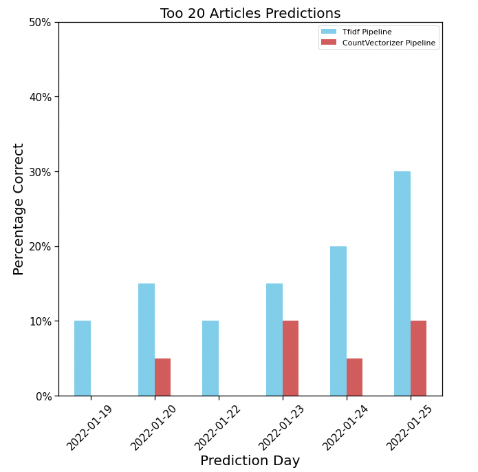

# Predicting New York Times Daily Top 20 Most Shared Articles on Facebook 

**Author**: Zach Hanly

## Overview

This project takes article inofmration from the New York times and uses NLP, Random Forest's and logistic regression to predict the daily top 20 most shared articles on Facebook. 

## Business and Data Understanding

In order to show how social media popularity for textual media can be modeled, article metadata was gathered from the New York Time's API website.

Two APIs were used. First, the __[NYT Archive API](https://developer.nytimes.com/docs/archive-product/1/overview)__,  which returns every article for a given range of months and years. Second, the __[NYT Most Popular API](https://developer.nytimes.com/docs/most-popular-product/1/overview)__, which returns the most popular articles on NYTimes.com based on emails, Facebook shares, or views on the NYT site. For this project Facebook shares were chosen and calls were made to the API once per day to gather that day's top 20 list. Articles in the archive that were listed on a top 20 list were then labeled as a popular article for a modeling target. 

## Modeling

#### Diagram
Two identical looking pipelines were used. One using a TfidfVectorizer which converted text features to floating point values and the other using a CountVectorizer that converted text to binary values. Each feature then went into its own model, where the TfidfVectorizer pipeline turned article features into a probability that the article would be on the top 20 most shared on facebook list, while the CountVecotized pipeline turned them into a binary class label. Both pipeline ends at a logistic regression model that outputs the probability that the article with all its converted features is a top 20 article. This final model is where the word count feature is joined in from its logistic regression model, turned into either a probability or a class label for the respective pipelines. 


#### Results 


## Conclusion


## For More Information

Please review the full analysis in my [Jupyter Notebook](./main_notebook.ipynb) or my [presentation](./presentation.pdf).

## Repository Structure

```
├── data                      <- Sourced externally from APIs and generated from modeling 
├── images                    <- Sourced externally and generated from code
├── notebooks                 <- building scripts for API calls and functions.py
├── .gitignore                <- files github should ignore 
├── README.md                 <- The top-level README for reviewers of this project
├── functions.py              <- created functions for project  
├── main_notebook.ipynb       <- Narrative documentation of modeling
├── request_archive.py        <- collects arichive of articles
├── request_most_shared.py    <- collects daily top 20 most shared article son facebook
├── presentation.pdf          <- PDF version of project 
```# nyt_predicting_sharable_article
